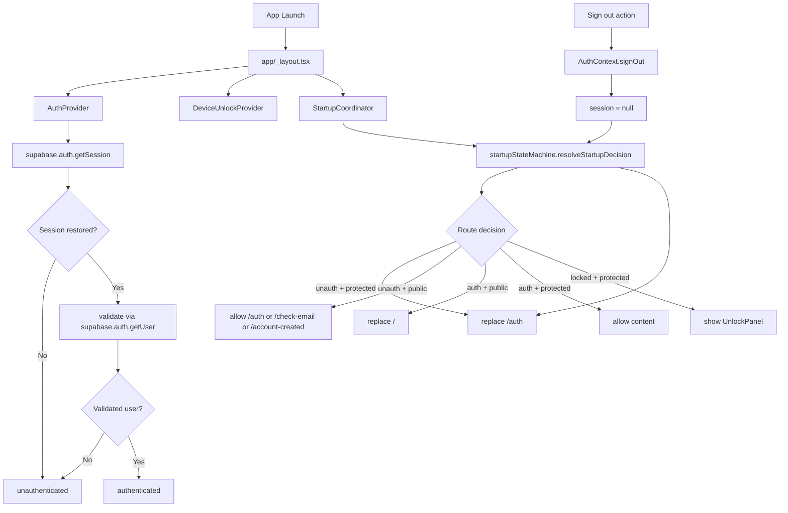

# Authentication and Routing Architecture Review

## Date
2026-06-02

## Executive Summary
The current repository has one active authentication implementation for runtime routing:

- One live auth route: /auth in app/auth.tsx
- One live startup routing authority: src/startup/StartupCoordinator.tsx + src/startup/startupStateMachine.ts
- One live auth state provider: src/state/AuthContext.tsx

Physical-device behavior (home opens, account says signed out, no authenticated user data, sign-out landing on login without demo controls) is not consistent with the current repository's intended route behavior. In current code, unauthenticated state should be redirected to /auth, and /auth currently contains Demo User controls.

Most likely explanation is repository-to-device runtime drift (device running an older or different JS/auth bundle than the reviewed code) plus stale/invalid auth state transitions on device. In the reviewed code, Startup V2 and Sign Out both target the same authentication route (/auth), not separate auth implementations.

## Architecture Diagram


## Authentication Route Map

### Public startup/auth routes
- /auth -> app/auth.tsx
- /check-email -> app/check-email.tsx
- /account-created -> app/account-created.tsx

Defined in:
- src/startup/startupRoutes.ts

### Protected routes (examples)
- / (app/index.tsx)
- /account (app/account.tsx)
- /routes (app/routes.tsx)
- /send (app/send.tsx)
- /track (app/track.tsx)
- /payment-methods (app/payment-methods.tsx)

### Every path that can navigate to an auth screen (/auth)
1. Startup V2 redirect from protected routes when unauthenticated.
   - src/startup/startupStateMachine.ts
   - src/startup/StartupCoordinator.tsx
2. Back-to-login action from check-email screen.
   - app/check-email.tsx -> router.replace("/auth")
3. Back-to-login action from account-created screen.
   - app/account-created.tsx -> router.replace("/auth")
4. Unlock panel "Use another account".
   - src/components/auth/UnlockPanel.tsx -> signOut() then router.replace("/auth")
5. Sign-out from account/menu indirectly (via auth state change).
   - app/account.tsx -> signOut()
   - src/components/navigation/AppDropdownMenu.tsx -> signOut()
   - Then StartupCoordinator redirects current protected route to /auth

## Demo User Location

### Implementation location
- src/state/AuthContext.tsx
  - enableDemoAccess()
  - Uses EXPO_PUBLIC_DEMO_EMAIL and EXPO_PUBLIC_DEMO_PASSWORD
  - Calls signIn(DEMO_EMAIL, DEMO_PASSWORD)

### UI location
- app/auth.tsx
  - Demo action button: Enter Demo Workspace
  - Calls handleDemoAccess() -> enableDemoAccess()

### Observability
Demo functionality is in the live auth screen implementation. It is not a startup-only feature and is not hidden behind route-level conditional rendering in app/auth.tsx.

## Which Login Screen Is Expected In Current Architecture
Expected login screen: app/auth.tsx at route /auth.

Characteristics in current code:
- Sign in / Create account toggle
- Email/password fields
- Primary auth button
- Demo button: Enter Demo Workspace

## Multiple Authentication Implementations Assessment

### Active runtime implementations
Only one active runtime auth flow is wired for routing:
- Auth state/provider: src/state/AuthContext.tsx
- Startup gate/routing: src/startup/StartupCoordinator.tsx
- Auth route UI: app/auth.tsx

### Non-runtime/historical copies
Historical startup/auth artifacts exist under rollback/governance paths (for example under governance/startup-architecture-v2/rollback/...), but these are documentation/baseline artifacts and are not part of the live Expo Router app tree.

Conclusion: multiple historical auth code copies exist in repository history artifacts, but only one live authentication implementation is active at runtime.

## Startup Route Analysis

### Exact launch-to-home path (when authenticated)
1. App starts in app/_layout.tsx and mounts providers.
2. AuthProvider bootstraps auth in src/state/AuthContext.tsx.
3. Bootstrap calls supabase.auth.getSession().
4. If session exists, code validates restored session with supabase.auth.getUser().
5. If validation succeeds: session set, sessionValidated=true, startupPhase="authenticated".
6. StartupCoordinator computes decision via resolveStartupDecision(...).
7. For route / with authenticated access and unlocked state: decision is allow with renderMode="content".
8. Home screen (app/index.tsx) is shown.

### Exact launch path (when unauthenticated)
1. Bootstrap yields no valid session (or stale session cleared).
2. session=null, sessionValidated=true, startupPhase="unauthenticated".
3. On protected route /, StartupCoordinator issues replace("/auth").
4. /auth renders app/auth.tsx.

### Biometric behavior on startup
Biometric unlock is not automatically triggered on launch for general auth restoration.

DeviceUnlockContext starts with locked=false. Startup state machine only renders unlock overlay for locked authenticated flows. Biometric prompts are explicitly triggered from:
- auth actions in app/auth.tsx
- unlock overlay in src/components/auth/UnlockPanel.tsx

## Sign Out Route Analysis

### Exact sign-out path
1. User taps sign out from:
   - app/account.tsx or
   - src/components/navigation/AppDropdownMenu.tsx
2. Both call signOut() from AuthContext.
3. signOut() sets:
   - session=null
   - sessionValidated=true
   - startupPhase="unauthenticated"
   - then calls supabase.auth.signOut()
4. StartupCoordinator reevaluates on current protected route.
5. Decision becomes unauthenticated + protected -> replace("/auth").
6. /auth renders.

Conclusion: Sign Out and Startup V2 unauthenticated redirects both target the same route (/auth) in current code.

## Does Startup V2 Route To Different Authentication Implementation Than Sign Out?
No, not in the current repository architecture.

Both Startup V2 unauthenticated path and Sign Out path converge to /auth (app/auth.tsx).

If a physical device lands on a login screen without Demo controls, that behavior does not match the currently reviewed /auth implementation and indicates runtime mismatch or stale deployed bundle behavior.

## Why The Physical-Device Behaviour Occurs
The reported set is internally inconsistent with current source behavior, indicating likely runtime drift:

1. Home opens directly while Account shows Signed Out and downstream says No authenticated user.
   - Current startup guard should redirect unauthenticated protected routes to /auth.
   - Seeing / with effectively unauthenticated data suggests device is not executing the same auth/startup code path currently in repository (or has stale persisted/runtime state from a different build/channel).

2. Login after Sign Out lacks Demo User functionality.
   - Current /auth includes the Enter Demo Workspace button in UI.
   - Missing demo controls strongly suggests the rendered login UI is from a different app version/implementation than current app/auth.tsx.

3. Biometric unlock not triggered on launch.
   - In current architecture this is expected unless app enters a locked flow (locked=true) or user triggers auth action requiring unlock.

Most likely repository-level cause for the observed device behavior:
- Deployed runtime/version mismatch (physical build or OTA bundle not aligned with current repository auth route implementation), potentially combined with stale auth state on-device.

## Root Cause Assessment

### Primary
Runtime code/version divergence between physical device execution and current repository auth/routing implementation.

### Secondary
Auth-state inconsistency symptoms (home route rendered while user-scoped data resolves unauthenticated) consistent with stale or non-authoritative local auth state in a non-current runtime.

### Not supported by current repository as primary cause
- Multiple active auth implementations in live app tree.
- Startup V2 and Sign Out pointing to different auth routes.

## Recommended Remediation (Smallest Possible)
1. Verify runtime parity before any code change.
   - Confirm physical device is running the current JS bundle/build tied to this repository state.
   - Confirm route /auth maps to app/auth.tsx from this revision.
2. Capture startup and sign-out telemetry on physical device from current bundle.
   - Validate startup decision events and route replacements.
   - Validate sign-out state transition and post-sign-out route.
3. Clear on-device auth persistence and reinstall from the same reviewed build artifact.
4. Re-test only these assertions:
   - unauthenticated launch -> /auth
   - /auth shows Demo button
   - authenticated launch -> /
   - sign-out from / -> /auth (same screen)

No architectural refactor is recommended at this stage because current repository wiring already converges startup and sign-out to the same auth implementation.

## Recommended Codex Prompt
```md
Perform a runtime parity and auth-route verification for NexusPay without changing architecture.

Context:
- Current repository has one active auth route: /auth in app/auth.tsx.
- Startup V2 and sign-out should both converge to /auth.
- Physical device appears to show a login UI without Demo button, which does not match current source.

Goals:
1. Verify the physical device is running the same code revision/bundle as this repository.
2. Verify /auth resolves to app/auth.tsx at runtime.
3. Validate startup path and sign-out path with telemetry evidence.

Do not refactor architecture.
Do not implement broad auth changes.

Tasks:
1. Add temporary, minimal runtime identifiers to app/auth.tsx, src/state/AuthContext.tsx, and src/startup/StartupCoordinator.tsx logs (version stamp + route stamp).
2. Run on physical device and capture logs for:
   - cold launch
   - account screen open
   - sign-out
3. Confirm whether startup and sign-out both route to the same /auth screen implementation.
4. If mismatch is confirmed, identify deployment/channel/version source of divergence and document exact correction steps.

Acceptance criteria:
- Evidence proves which bundle is executing on device.
- Evidence proves actual route target for startup unauth redirect and sign-out redirect.
- Demo button presence/absence is reconciled with executed source file.
```
