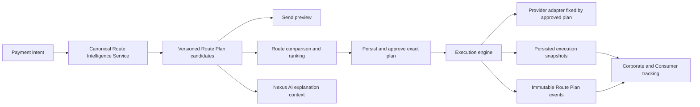

# NexusPay Canonical Route Intelligence Architecture V1

## Authority and Objective

This document defines the Route Plan V1 contract and the single route-intelligence path used by NexusPay payment screens. It supersedes the former Send preview, quote-screen templates, settlement-orchestrator ranking, AI score table, and execution-time provider reselection.

The architecture is evidence-first and fail-closed: missing evidence produces `UNAVAILABLE`; it does not produce a favourable estimate.

## Canonical Flow

## Route Plan V1

`CanonicalRoutePlan` is defined in `src/types/routePlan.ts`. It contains:

- funding method, provider, availability, and quote evidence;
- bridge requirement, rail, asset, provider, path quote, fee, and slippage;
- payout method, provider, corridor, beneficiary capability, transfer capability, fee, and limit;
- settlement method;
- current FX, spread, provider/network fees, estimated recipient amount, and total cost;
- ETA, confidence, evidence risk, liquidity, capacity, historical success/latency, compliance eligibility, and evidence coverage;
- eligibility reasons, rank, evidence score, provenance, generation time, expiry, plan version, and lifecycle status.

Every evidence-bearing field records value, provenance, source, observation time, confidence, and an optional reason.

## Provenance Contract

Supported field labels are `LIVE`, `SANDBOX`, `TESTNET`, `DERIVED`, `ESTIMATED`, `SIMULATED`, `FALLBACK`, `UNAVAILABLE`, and `DEMO`.

Route approval requires live FX and validated provider capabilities. Compile-time FX fallback values are never consumed by the canonical engine. Unavailable fees, limits, liquidity, capacity, spread, or RLUSD market evidence remain null and visible.

## Evidence Sources

| Evidence | Source | Current classification |
|---|---|---|
| FX rate | Existing multi-provider live FX service | LIVE when a provider responds; otherwise UNAVAILABLE |
| Yapily connectivity | `partner_connection_tests` | SANDBOX |
| Yapily institution/payment capability | `partner_capabilities` and latest institution count | SANDBOX when validated; otherwise UNAVAILABLE |
| Airwallex connectivity | `partner_connection_tests` | SANDBOX |
| Airwallex beneficiary/transfer capability | `partner_capabilities`, with completed authenticated executions as derived corroboration | SANDBOX or DERIVED |
| Airwallex corridor | `partner_supported_corridors` | Database provenance, currently DERIVED |
| Historical success and latency | Terminal `execution_sessions` for Airwallex | DERIVED |
| RLUSD balance | XRPL testnet `account_lines` result supplied by wallet context | TESTNET |
| RLUSD path, depth, slippage, fee | Not implemented | UNAVAILABLE |

## Eligibility and Ranking

Direct banking eligibility requires all of:

1. fresh successful Yapily connectivity;
2. validated institution discovery and at least one returned institution;
3. validated Yapily payment initiation;
4. fresh successful Airwallex connectivity;
5. validated beneficiary and transfer capability;
6. supported database corridor;
7. live FX;
8. bank payout and open-banking funding.

Only eligible candidates receive a score. Available evidence is weighted as follows:

| Component | Weight |
|---|---:|
| Provider and capability availability | 35% |
| Live FX | 15% |
| Historical terminal success | 20% |
| Historical settlement latency | 10% |
| Corridor, payout, and compliance eligibility | 20% |

Missing optional history is excluded and evidence coverage is disclosed. Missing mandatory evidence blocks eligibility and removes the score. Evidence risk is `100 - evidence confidence`; it is not represented as a predicted provider-failure probability.

## XRPL Rule

XRPL/RLUSD is generated as an unavailable comparison candidate, not an executable route. It cannot be ranked or approved until NexusPay has a validated RLUSD trustline/balance, an executable path quote, depth, slippage, transaction fee, and an executor that actually transfers RLUSD. The present executor transfers testnet XRP and therefore cannot satisfy the advertised RLUSD route.

## Persistence and Execution

`route_plans` stores versioned plan JSON and indexed decision fields. `route_plan_events` stores immutable approval, execution, completion, failure, supersession, and failover transitions. Owner-scoped RLS prevents cross-user reads and writes.

The selected plan must be persisted before approval. State transitions are checked against the stored state. The execution engine uses the approved plan's payout-provider ID and no longer reselects a provider independently. A failure records the failed plan, reason, replacement plan, approval, and execution transition before failover continues.

## Current Security Boundary

V1 centralises calculation in one application service and validates/persists plans under authenticated RLS. It does not yet provide a server-signed route decision. Before production use, generation and approval must move behind a Supabase Edge Function or equivalent trusted backend, with server-only provider evidence and an immutable plan digest verified by execution.

## Rollback

Application rollback restores the prior commit. Database rollback drops `route_plan_events` before `route_plans`; the migration is additive and does not alter existing payment tables. Existing legacy transfers without a Route Plan remain readable and can use the legacy recovery path, but new screens no longer generate legacy routes.
